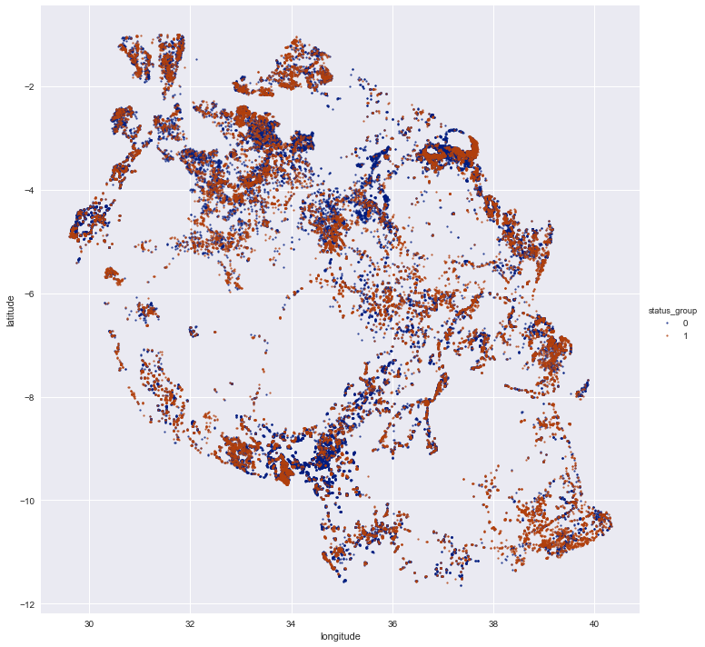

# Tanzania Water Pump Prediction

### Introduction
Conducted by Brayton Hall.

- [Data](#data)
- [EDA](#eda)
- [Model](#model)
- [Conclusions](#concl)

## Project Goals
My aim was to predict the functionality of water pumps throughout villages in Tanzania, and perhaps formulate some actionable response from the most important features. 

## Data Collection 
The data was obtained from Taarifa (Rwandan News) and the Tanzanian Ministry of Water via the open prediction competition on [drivendata.org](https://www.drivendata.org/competitions/7/pump-it-up-data-mining-the-water-table/). Important features among 40 initial independent variables include:
- pump type
- water quality
- elevation
- region

## EDA 

### Data Cleaning
Many columns were dropped if they had a somewhat duplicate column on which they merely grouped information into broader classes, as well as columns missing many values, resulting in a total of 21 features and 59,400 samples.

### Data Exploration
Medium initial correlations were found between the following features and target variable (status_group): 
-Pump type: 0.22
-Quality: .16
-Elevation: -.11
-Region: .11

## Model & Results 
Models used were Baseline, Random Rorest, KNN, and Logistic. Interestingly, KNN performed the best, with a final gridsearch KNN (n = 9) model producing an f1 score of .74 and an accuracy score of .81. Perhaps KNN was the best model due to the clustering of important independent features around each other (such as similar elevations or villages in isolated mountain regions, with small populations and fewer resources).

## Feature Analysis
An xgboost feature importance plotter revealed the most important features in the dataset, since KNN has no such method (being a lazy learner). The most important features were Elevation, Population, Construction year, and Region, which are all indicators of clustered causal features related to geography, and likely resource availability. 
### 
### 
### )

## Conclusions 
Elevation, Population, Construction year, and Region were the most important features for prediction pump functionality.//
These aren't easily actionable findings, since they indicate a broader systematic problem involving overuse by isolated mountain villages without resources to repair or build new pumps.//
Solutions would most likely require providing isolated communities with material assistance.//
 

